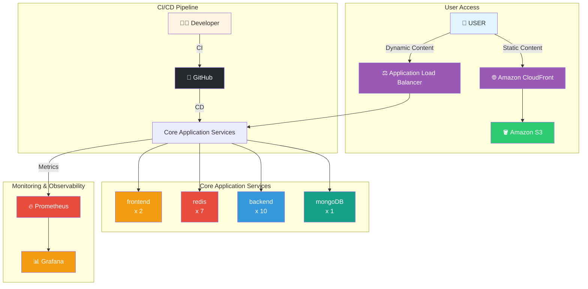

# We are on the Cloud ☁️

> 카카오 테크 부트캠프 10조 프로젝트

실시간 채팅 애플리케이션을 클라우드 환경에 배포하고 운영하는 프로젝트입니다.

## 👥 팀원

- **estar** 
- **green**  
- **ellim** 
- **jina** 
- **eden** 
- **max** 

## 📋 프로젝트 개요

이 프로젝트는 **실시간 채팅 애플리케이션**을 클라우드 환경에서 구축하고 운영하는 것을 목표로 합니다. Socket.IO 기반의 실시간 메시징, 파일 공유, AI 멘션 기능 등을 제공하며, Prometheus와 Grafana를 활용한 모니터링 시스템을 구축했습니다.

### 주요 특징

- 🚀 **실시간 통신**: Socket.IO 기반의 양방향 실시간 메시징
- 🤖 **AI 통합**: OpenAI를 활용한 지능형 멘션 기능
- 📊 **모니터링**: Prometheus + Grafana 기반 통합 관찰성 스택
- 🧪 **테스트**: E2E 테스트 및 커스텀 로드 테스트 도구
- ☁️ **클라우드 배포**: AWS 환경에서의 프로덕션 배포 및 운영

## 시스템 아키텍처



### 아키텍처 설명

#### 사용자 접근 경로
- **정적 콘텐츠**: 사용자 → Amazon CloudFront → Amazon S3
- **동적 콘텐츠**: 사용자 → Application Load Balancer (ALB) → 애플리케이션 서비스

#### CI/CD 파이프라인
- 개발자가 코드를 GitHub에 푸시하면 자동으로 CI/CD 파이프라인이 실행되어 애플리케이션 서비스에 배포됩니다.

#### 핵심 애플리케이션 서비스
- **Frontend** (x2): Next.js 기반 프론트엔드 서버 인스턴스
- **Backend** (x10): Spring Boot 기반 백엔드 서버 인스턴스
- **Redis** (x7): 캐시 및 세션 저장소 인스턴스
- **MongoDB** (x1): 메인 데이터베이스 인스턴스

#### 모니터링 스택
- **Prometheus**: 애플리케이션 서비스로부터 메트릭을 수집
- **Grafana**: Prometheus 데이터를 시각화하여 대시보드 제공

## 🏗️ 프로젝트 구조

```
We_are_on_the_cloud/
├── 10-ktb-BootcampChat-ktb-3rd-BE/    # 백엔드 모노레포
│   ├── apps/
│   │   ├── backend/                   # Spring Boot 백엔드 서버
│   │   └── frontend/                   # Next.js 프론트엔드 (레거시)
│   ├── e2e/                           # E2E 테스트 (Playwright)
│   ├── loadtest/                      # 부하 테스트 도구
│   └── monitoring/                    # Prometheus & Grafana 설정
│
└── 10-ktb-BootcampChat-ktb-3rd-FE/    # 프론트엔드 모노레포
    ├── apps/
    │   └── frontend/                   # Next.js 프론트엔드
    ├── e2e/                           # E2E 테스트
    └── loadtest/                      # 부하 테스트 도구
```

## 🛠️ 기술 스택

### Backend
- **Framework**: Spring Boot 3.5.7
- **Language**: Java 21
- **Database**: MongoDB 8
- **Cache**: Redis
- **Real-time**: Netty Socket.IO Server
- **Security**: Spring Security + JWT
- **AI**: Spring AI (OpenAI)
- **Monitoring**: Spring Boot Actuator + Micrometer

### Frontend
- **Framework**: Next.js 15.1.9
- **UI Library**: React 18.3.1
- **Styling**: Tailwind CSS 4.0, Vapor UI Design System
- **Real-time**: Socket.IO Client 4.7.2
- **HTTP Client**: Axios

### Infrastructure & DevOps
- **Container**: Docker & Docker Compose
- **Monitoring**: Prometheus 3.1.0, Grafana 11.4.0
- **Testing**: Playwright (E2E), 커스텀 로드 테스트
- **Cloud**: AWS (EC2, ALB, Route53, ACM)

## ✨ 주요 기능

### 인증 및 사용자 관리
- 이메일 기반 사용자 인증 시스템
- JWT 토큰 기반 인증
- 사용자 프로필 관리 (이미지 업로드 포함)

### 실시간 채팅
- Socket.IO 기반 실시간 메시지 송수신
- 채팅방 생성 및 관리
- 실시간 참여자 상태 표시
- 메시지 읽음 상태 표시

### 고급 채팅 기능
- **이모지 리액션**: 메시지에 이모지 반응 추가
- **멘션 기능**: @username으로 사용자 멘션
- **AI 멘션**: OpenAI를 활용한 지능형 응답 생성
- **파일 공유**: 이미지 및 PDF 파일 업로드/다운로드
  - 이미지 미리보기 기능
  - 파일 형식별 크기 제한 (1MB)

### 모니터링 및 관찰성
- **Prometheus**: 메트릭 수집 및 저장
- **Grafana**: 대시보드를 통한 시각화
- **Spring Boot Actuator**: 애플리케이션 메트릭 노출
- **Node Exporter**: 서버 리소스 모니터링
- **MongoDB/Redis Exporter**: 데이터베이스 메트릭 수집

## 🚀 빠른 시작

### 사전 요구사항

- **Java 21** (백엔드)
- **Node.js 18+** (프론트엔드)
- **Docker & Docker Compose** (로컬 개발)
- **MongoDB** (로컬 또는 Docker)
- **Redis** (로컬 또는 Docker)

### 백엔드 실행

```bash
cd 10-ktb-BootcampChat-ktb-3rd-BE/apps/backend

# Java 21 자동 설치 (선택)
make setup-java

# 환경 변수 설정
cp .env.template .env
# .env 파일 편집 (필수 환경 변수 설정)

# 개발 서버 실행
make dev
```

백엔드 서버는 다음 포트에서 실행됩니다:
- **REST API**: http://localhost:5001
- **Socket.IO**: http://localhost:5002
- **API 문서**: http://localhost:5001/api/swagger-ui.html

### 프론트엔드 실행

```bash
cd 10-ktb-BootcampChat-ktb-3rd-FE/apps/frontend

# 의존성 설치
npm install

# 환경 변수 설정
cp .env.example .env.local
# .env.local 파일 편집

# 개발 서버 실행
npm run dev
```

프론트엔드는 http://localhost:3000 에서 실행됩니다.

### 모니터링 스택 실행

```bash
cd 10-ktb-BootcampChat-ktb-3rd-BE/apps/backend

# 모니터링 스택 시작
make o11y-up
```

모니터링 도구 접속:
- **Prometheus**: http://localhost:9090
- **Grafana**: http://localhost:3000 (admin/admin)

## 📚 상세 문서

### 백엔드
- [백엔드 README](./10-ktb-BootcampChat-ktb-3rd-BE/apps/backend/README.md) - 백엔드 개발 가이드
- [배포 가이드](./10-ktb-BootcampChat-ktb-3rd-BE/apps/backend/DEPLOY.md) - 프로덕션 배포 방법
- [모니터링 가이드](./10-ktb-BootcampChat-ktb-3rd-BE/apps/backend/monitoring/README.md) - 모니터링 설정 및 사용법

### 프론트엔드
- [프론트엔드 README](./10-ktb-BootcampChat-ktb-3rd-FE/apps/frontend/README.md) - 프론트엔드 개발 가이드
- [배포 가이드](./10-ktb-BootcampChat-ktb-3rd-FE/apps/frontend/DEPLOYMENT.md) - 프론트엔드 배포 방법

### 테스트
- [E2E 테스트](./10-ktb-BootcampChat-ktb-3rd-BE/e2e/README.md) - Playwright 기반 E2E 테스트
- [로드 테스트](./10-ktb-BootcampChat-ktb-3rd-BE/loadtest/README.md) - 부하 테스트 도구 사용법

## 🧪 테스트

### E2E 테스트 실행

```bash
cd 10-ktb-BootcampChat-ktb-3rd-BE/e2e
npm test
```

### 로드 테스트 실행

```bash
cd 10-ktb-BootcampChat-ktb-3rd-BE/loadtest

# 가벼운 테스트 (50명)
npm run test:light

# 중간 테스트 (200명)
npm run test:medium

# 무거운 테스트 (1000명)
npm run test:heavy

# 점진적 부하 테스트 (500명, 임계점 테스트)
npm run test:rampup
```

## 📊 모니터링

프로젝트는 Prometheus와 Grafana를 활용한 통합 모니터링 시스템을 제공합니다.

### 수집되는 메트릭

- **애플리케이션 메트릭**: HTTP 요청, 응답 시간, 에러율
- **시스템 메트릭**: CPU, 메모리, 디스크, 네트워크
- **데이터베이스 메트릭**: MongoDB 연결, 쿼리 성능
- **캐시 메트릭**: Redis 메모리, 키 수, 히트율

### 대시보드

Grafana에서 다음 대시보드를 확인할 수 있습니다:
- Spring Boot 애플리케이션 메트릭
- 서버 리소스 사용량
- MongoDB 성능 지표
- Redis 캐시 상태

## 🚢 배포

### 백엔드 배포

```bash
cd 10-ktb-BootcampChat-ktb-3rd-BE/apps/backend

# JAR 빌드
make build-jar

# 서버로 배포
make deploy-jar

# 서버에서 애플리케이션 시작
ssh ktb-be01 "cd /home/ubuntu/ktb-chat-backend && ./app-control.sh start"
```

자세한 내용은 [배포 가이드](./10-ktb-BootcampChat-ktb-3rd-BE/apps/backend/DEPLOY.md)를 참조하세요.

### 프론트엔드 배포

```bash
cd 10-ktb-BootcampChat-ktb-3rd-FE/apps/frontend

# 프로덕션 빌드
make build-local

# 서버로 배포
make deploy
```

## 🏛️ 아키텍처

### 시스템 구성

```
┌─────────────┐
│   Client    │ (Next.js Frontend)
└──────┬──────┘
       │
       ├── REST API (HTTP)
       └── WebSocket (Socket.IO)
       │
┌──────▼──────────────────────────────┐
│      Backend Server                 │
│  ┌──────────┐  ┌──────────────┐   │
│  │ REST API │  │ Socket.IO    │   │
│  │  :5001   │  │   :5002      │   │
│  └──────────┘  └──────────────┘   │
└──────┬──────────────────────────────┘
       │
       ├── MongoDB (데이터 저장)
       ├── Redis (캐시/세션)
       └── OpenAI API (AI 멘션)
       │
┌──────▼──────────────────────────────┐
│   Monitoring Stack                  │
│  ┌──────────┐  ┌──────────────┐   │
│  │Prometheus│  │   Grafana    │   │
│  │  :9090   │  │    :3000     │   │
│  └──────────┘  └──────────────┘   │
└─────────────────────────────────────┘
```

## 🔐 보안

- JWT 기반 인증 및 인가
- AES-256 암호화를 통한 민감 정보 보호
- Rate Limiting을 통한 API 보호
- MongoDB TTL 기반 세션 관리
- Spring Security를 통한 보안 강화

## 📈 성능 최적화

- Redis를 활용한 캐싱
- 비동기 처리 (Spring Async)
- MongoDB 인덱스 최적화
- Socket.IO 연결 풀 관리
- 파일 업로드 크기 제한

## 🤝 기여 가이드

1. 이슈를 생성하거나 기존 이슈를 확인합니다
2. 기능 브랜치를 생성합니다 (`git checkout -b feature/amazing-feature`)
3. 변경사항을 커밋합니다 (`git commit -m 'Add some amazing feature'`)
4. 브랜치에 푸시합니다 (`git push origin feature/amazing-feature`)
5. Pull Request를 생성합니다

## 📝 라이선스

이 프로젝트는 카카오 테크 부트캠프 교육용 프로젝트입니다.

## 🙏 감사의 말

이 프로젝트는 카카오 테크 부트캠프의 지원 하에 개발되었습니다.

---

**Made with ❤️ by Team 10 - We are on the Cloud**
